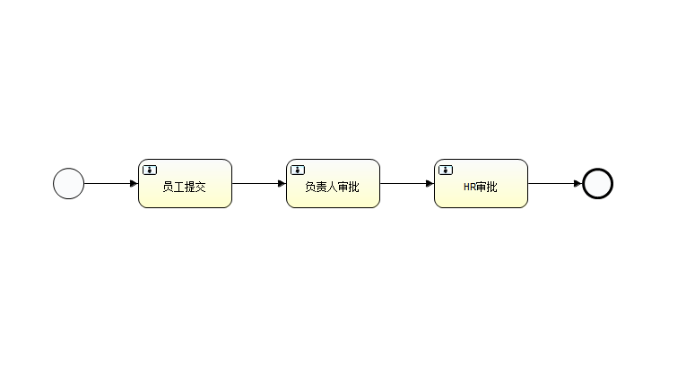
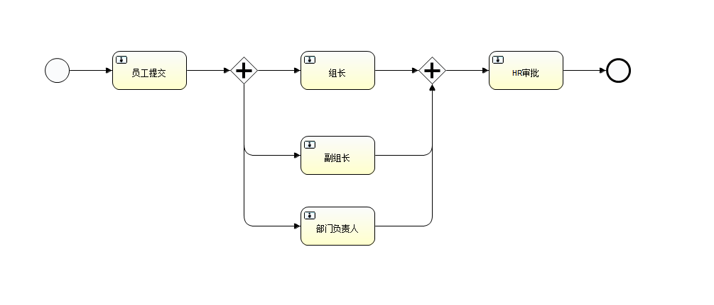

### BPMN 介绍
BPMN 底层实际是 XML:

* 构成 BPMN 的 XML 主要标签构成：
````
       //整体定义标签
       <definitions> </definitions>
       
       //流程定义标签，可以看作生成的 png 上，所有能看到的，包括 起点、任务节点、连线、网关、结束点...
       <process> </process>
       
       //起点
       <startEvent> </startEvent>
           
       //用户任务，流程的任务节点
       <userTask> </userTask>
       
       //结束点
       <endEvent> </endEvent>
       
       //序列线，这里我理解为两个节点间连线的起点和终点(由谁连接到谁)
       <sequenceFlow> </sequenceFlow>
       
       //排他网关 
       <exclusiveGateway> </exclusiveGateway>
       
       //包含网关 
       <inclusiveGateway> </inclusiveGateway>
       
       //并行网关 
       <parallelGateway> </parallelGateway>
       
       //BPMN图
       <<bpmndi:BPMNDiagram> </<bpmndi:BPMNDiagram>
       
       //图形，主要指 <process> 内的节点大小
       <<bpmndi:BPMNShape> </<bpmndi:BPMNShape>
       
       //边缘，可以理解为连接线(由谁怎样连接到谁，直线还曲线...)
       <bpmndi:BPMNEdge> </bpmndi:BPMNEdge>
       
````  
* [流程中直线单节点单任务 XML（无法打开时将后缀 .bpmn 改为 .xml）](https://github.com/yan-qiang/GenerateBpmn/blob/main/src/main/resources/templates/single.bpmn)


* [流程中某一节点多任务 XML（无法打开时将后缀 .bpmn 改为 .xml）](https://github.com/yan-qiang/GenerateBpmn/blob/main/src/main/resources/templates/multi.bpmn)


### 指南

    /entity: 
        /base:   基础对象
        /common: 对外使用生成时实体
    /exception:  异常对象
    /main:       case类
    /util:       自动生成工具
    
    /resource:
        /templates
             multi.bpmn    多节点BPMN/xml
             multi.png     多节点图片
             single.bpmn   单节点BPMN/xml
             single.png    单节点图片

### 扩展
    
    目前只支持直线单节点和直线多节点，且网关只支持并行，只适合简单的流程生成，不适合复杂流程使用！！！
    如果这种简单的流程不能支持业务，如网关里面还有网关、网关后的流程各不相同...等等各种复杂的流程图
  
  **支持自定义流程**
   
   * [自定义流程相当于重写 producedXmlStr() 方法](https://github.com/yan-qiang/GenerateBpmn/blob/main/src/main/java/com/kk/activity/util/AutoGenerateFlowUtils.java)
   
    大致思想如下：
    1、 创建一个流程 QhProcess
    2、 创建 start、end 节点
    3、 创建[任务1] 节点
    4、 创建连接线，[start] --> [任务1]
    5、 创建 [网关] 节点 （注意网关有开闭两个）
    6、 创建 [任务N] 节点
    7、 创建连接线，[网关(开)] --> [任务N]
    8、 创建连接线，[网关(开)] --> [任务N + 1]
    9、 .....
    10、创建连接线，[任务N] --> [网关(关)]
    11、创建连接线，[任务N + 1] --> [网关(关)]
    12、.....
    13、创建连接线，[任务Z] --> [end]
    
    
  PS: 目前连接线只有简单的几种，想要实现多种形态的线，
  [参考 linkEndwiseLongLineTo() 方法](https://github.com/yan-qiang/GenerateBpmn/blob/main/src/main/java/com/kk/activity/entity/base/FlowNode.java)